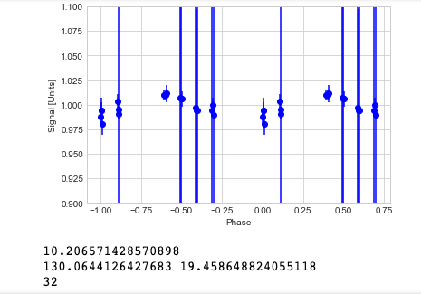
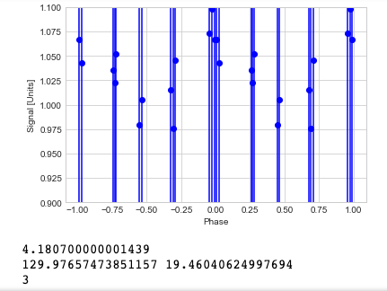

#Blog Post Week 10

## This Week's Work

### Updates

I've made improvements to my code doing photometry for all my data. Specifically, my settings for aperture photometry were way off from what they should be; the aperture and annuli size were significantly reduced to 8 pixels, and 12-17 pixels respectively. This improved my comparison stars plot by reducing the errors as well as the number of outliers:

This overall reduced my error bars, although many remain quite large (~+/-1 relative flux). Updated plots are as below:

<embed src="https://noah-goldman.github.io/Praesepe_2_V.pdf" type="application/pdf" />

<embed src="https://noah-goldman.github.io/Praesepe_2_all.pdf" type="application/pdf" />

If you look closely, you'll notice some sources are repeated in the plots. This was indeed true for last week's plots as well; after looking into this I found the error is not in the plotting but instead some sources are actually repeated once or twice in the data files. While I'm not sure where this is coming from, my sample size of potential rotators is small enough to simply leave these copies and be aware of their presense while trying to look for variables. 

On the topic of finding periods, I have made major progress towards applying periodograms to the light curves. After fixing a bug related to NaN values, I ran the periodograms on all light curves in the V band:

~~~ python
for k in range(len(Vflux[0, :])):
    a      = Vflux[:, k]
    aerr   = Vfluxerr[:, k]
    time   = dataV['time']
    if len(time[a>1e-50])>1:
        f, p   = LombScargle(time[a>1e-50], a[a>1e-50], aerr[a>1e-50]).autopower()
        per    = 1/f
        fp, pp = f[per>3], p[per>3]
        best_frequency = fp[np.argmax(pp)]
        phase = (time-np.amin(time))*best_frequency
        stnd_phase = phase - np.floor(phase)
        pphase = stnd_phase - 1
        plt.errorbar(stnd_phase[a>1e-50], a[a>1e-50], aerr[a>1e-50], fmt='bo')
        plt.errorbar(pphase[a>1e-50], a[a>1e-50], aerr[a>1e-50], fmt='bo')
        plt.xlabel('Phase')
        plt.ylabel('Signal [Units]')
        plt.ylim(0.9, 1.1)
        plt.show()
        print(1/best_frequency)
        print(dataV['ra'][k], dataV['dec'][k])
        print(k)
~~~

Because the power spectrum fluctuates wildly and often peaks at values much shorter than we expect for late type rotators, I require the best fit period be longer than three days. Despite this we still report some oddities; around 11 independent (not including duplicates) sources seem to have a period very close to 6.495, and other identical periods are present. I haven't determined the source for this phenomenon or whether it will be problematic, but I am looking into it. There have been some successes in the period search:

These two sources seem to have pretty strong evidence for being periodic variables. I'm still working on fitting them using sinusoids to see just how they act as rotators but at this point I am quite satisfied with these two and several others.

### Goals and directions for poster draft

Last week as part of the writing portion of the project my partner and I worked on an outline for our final poster to present our findings. Now the goal for this week is to turn the outline into a working draft, i.e. in poster format. Based on feedback we received during class last Wednesday, it seems the current iteration of the outline is in very good shape, although it did have some flaws in certain places. Based on this feedback as well as other discussion about presentations that happened during class, we'll attempt to work on the following:

* The title and abstract/introduction need to be clearer about what our scientific goals are.
* Introduction and abstract are too lengthy and dense; rather than draw out the context to explain everything, it's better to summarize in just a few sentences in order to draw more attention to analysis, conclusions, and figures.
* Certain details need to be filled in with the data/analysis sections, e.g. why don't we perform dark current subtraction on our images?
* The outline referred to several figures we might include in the final presentation. However, it was devoid of any actual figures despite we're at the point now where we can produce light curves, periodograms, etc. Thus, we should try to get a figure or two, even if we cannot get all of the figures we'd like.
* There are many archetypes of posters as seen in last week's slides. We'll need to make a decision for what sort of graphical appearance will make our poster enticing to read and straightforward to understand.

At the moment, work on these is in progress, and I hope once they are complete we will have a nice looking presentation ready for the final!
