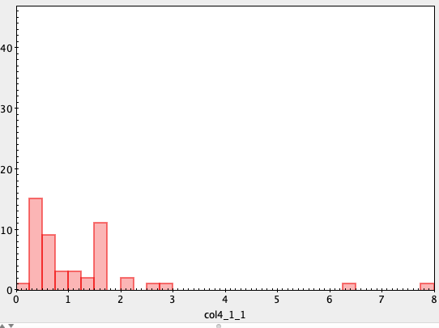
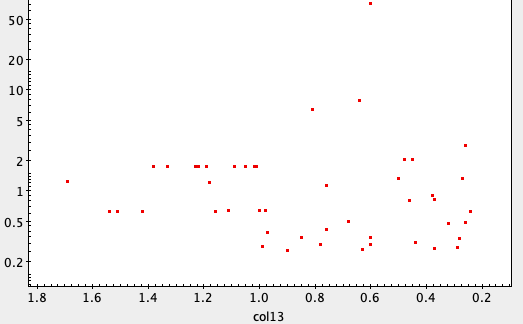
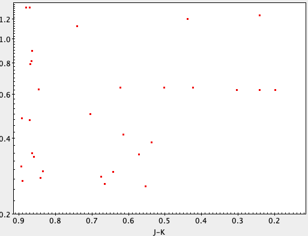

# Blog post: Week 11

## Worked on this Week

### Updating figures for the final poster

Reaching the final stages of the project, I'm finally getting around to deciding on values to use for period calculations. Tweaking things around on the flux measurement side of things, my final inputs for aperture and annulus size are 10 pixel aperture, 20 pixel inner radius and 40 pixel outer radius (or 10 pixel buffer and 20 pixel radius difference). A FWHM of four pixels and sigma detection threshold of 4 were selected for source detection. Doing this along with fixing a bug in light curve plotting improved my typical error bars from +/- 1 rel. flux to +/- 0.5 rel. flux. Some points still retained extremely high errors, typically night 2 and night 8 fluxes, which agrees with my previous discussion on quality in the photometry over the run, so these points were taken out of the computation for the later portion: periodogram analysis. The main change in the code I made here is that while at first I was distrusting of seeing periodogram peaks corresponding to periods of less than ~2 days, however having revisited the literature, periods this short are actually in line with what we might expect for our sample. Thus, I removed the limit forcing matched periods to be higher and reran the period computations, taking everything it would return. In the end, periods were able to be produced for 51 objects. The histogram of periods lies below:

With these I could match with my previous table matches from Vizier: the table from "The Factory and the Beehive: Activity and Rotation in Praesepe and the Hyades" (Douglas, 2014) containing mass estimates (among other quantities) and photometric data from 2MASS; as mentioned in a previous blog, both tables matches with our entire pre-matched source list. Then with periods, I could begin making plots of interest. Here's my plot of period versus mass, using the mass computations from Douglas, 2014:

And here's a plot of period versus J-K color from 2MASS data:

I'm currently in the process of checking with my partner on how he's prepared similar plots and whether we should go ahead and try to put these on the final presentation.

Here's a preview of the table I'm using to produce these plots. Unfortunately as the list of columns is of course quite long I am omitting here, but includes everything from our period and peak-to-peak estimations, to 2MASS photometry, to estimates of phsyical parameters mass, period, and h-alpha width:
~~~
0.0	129.97139483167638	19.401091298934084	0.48134761904776147	0.05548470093403712	0.0147	129.9715	19.4010389	AD 2642	08 39 53.16	+19 24 03.74	82	M3	16.596	13.014		NaN	0.26	NaN	N		-3.187	15.725	0.40388659324501075	0.0	129.97139483167638	19.401091298934084	0.48134761904776147	0.05548470093403712	129.971521	19.401047	08395316+1924037	13.905	0.026	13.314	0.03	13.014	0.031	AAA	222	111	000	0	0	0.8909998	0.4571341887204241	0.0
2.0	130.01722300131615	19.41400640032525	2.830324000000838	0.092675686586417	0.013	130.0173333	19.4139639	JS718	08 40 04.16	+19 24 50.27	99	M3	17.155	12.967		0.33	0.26	0.0377	N		-8.671	31.011	0.40466686093680193	2.0	130.01722300131615	19.41400640032525	2.830324000000838	0.092675686586417	130.017345	19.413961	08400416+1924502	13.836	0.023	13.21	0.024	12.967	0.031	AAA	222	111	000	0	0	0.86900043	0.4453021031235174	0.0
3.0	129.97657473851157	19.46040624997694	0.032621276596786465	1.2139425705272675	0.0135	129.9767083	19.4603361	HSHJ291	08 39 54.41	+19 27 37.21	99	M4	18.005	13.358		NaN	0.22	0.0157	N		-4.278	11.732	0.5190258293908345	3.0	129.97657473851157	19.46040624997694	0.032621276596786465	1.2139425705272675	129.976723	19.460339	08395441+1927372	14.242	0.026	13.608	0.041	13.358	0.041	AAA	222	111	000	0	0	0.8839998	0.5584557151932104	0.0
7.0	129.76209086026597	19.532590865539074	2.0216600000005984	0.06358598747900812	0.007	129.7620833	19.5325417	JC143	08 39 02.90	+19 31 57.15	99	M3	16.132	11.962		NaN	0.48	NaN	N		-5.815	21.005	0.178947545336215	7.0	129.76209086026597	19.532590865539074	2.0216600000005984	0.06358598747900812	129.762127	19.532562	08390291+1931572	12.829	0.022	12.182	0.021	11.962	0.019	AAA	222	111	000	0	0	0.8670006	0.16072697501647817	0.0
8.0	130.04801155265892	19.653241220982835	2.0216600000005984	0.0560782413047578	0.0124	130.0482917	19.6532722	HSHJ302	08 40 11.59	+19 39 11.78	99	M4	16.206	12.071		NaN	0.45	NaN	N		-5.068	18.667	0.9562010981121642	8.0	130.04801155265892	19.653241220982835	2.0216600000005984	0.0560782413047578	130.048285	19.653278	08401158+1939118	12.939	0.021	12.332	0.023	12.071	0.023	AAA	222	111	000	0	0	0.86800003	0.9364711781223884	0.0
9.0	129.9468797038492	19.659504888041926	1.3350584905664327	0.07773468751437729	0.0092	129.9470833	19.6595444	2MASSJ08394730+1939344	08 39 47.30	+19 39 34.36	99	M4	17.602	12.904		NaN	0.27	0.0246	N		-4.507	11.99	0.704869105350324	9.0	129.9468797038492	19.659504888041926	1.3350584905664327	0.07773468751437729	129.947094	19.659557	08394730+1939344	13.784	0.026	13.204	0.03	12.904	0.033	AAA	222	111	000	0	0	0.8800001	0.7503276370670654	0.0
10.0	130.01011212708008	19.676451721125144	0.3385555023924447	0.05066355957071078	0.0106	130.010375	19.6764833	HSHJ293	08 40 02.49	+19 40 35.34	99	M3	16.986	12.851		NaN	0.28	NaN	N		-2.361	8.698	0.8983223305637842	10.0	130.01011212708008	19.676451721125144	0.3385555023924447	0.05066355957071078	130.010376	19.676485	08400249+1940353	13.71	0.025	13.125	0.026	12.851	0.026	AAA	222	111	000	0	0	0.8590002	0.9024618120724398	0.0
11.0	129.81274534100092	19.72540438672044	0.7950348314609094	0.05814600324625041	0.0013	129.812875	19.7254528	JS706	08 39 15.09	+19 43 31.63	99	M4	16.012	12.015		NaN	0.46	0.0205	N		-4.199	16.891	0.47265782287456887	11.0	129.81274534100092	19.72540438672044	0.7950348314609094	0.05814600324625041	129.81292	19.725468	08391510+1943316	12.883	0.023	12.26	0.026	12.015	0.021	AAA	222	111	000	0	0	0.86800003	0.6346356503861835	0.0
~~~

### Notes on reading relevant science papers

One paper I've been meaning to get to for while is the one mentioned above talking about mass estimates: "The Factory and The Beehive" (Douglas, 2014). I've relied on this paper for several small things in previous blogs and assignments, however I've never really gotten around to actually going through it, so I figure now is as good a time as any, especially if I'm using their esimate for mass or other quantities in my final poster. Specifically what I want to get out of this is how they go about calculating quantities that might be useful here.

This is the second paper in a series. The first in the series is focused on computing rotation periods for their sources, much as we have done; instead this paper talks about making spectrographic measurements of their sources. Because they're focused on activity they spend much of the paper on discussing equivalent widths of the H-alpha line, which I will skip over as this is less relavant to what I'm looking for. After this however, they do go into producing period-mass diagrams, so I will focus my summary on this section. The masses seem to be derived using a relation between K magnitude and mass found by Kraus and Hillenbrand (2007). They mention this model rather than others is more attuned to computing masses below 0.5 solar masses and goes all the way down to L spectral types, thus is better suited both for their and our purposes. Additionally, they used a different method for mass computation in part one of the series, and no source differed in its mass estimate between the two more than 0.07 solar masses, which is certainly accurate enough for our purposes.

Having found the source of mass estimates I wanted to see how they got their radius estimates found in the table I matched to get the masses. Interesting, I couldn't find any reference to radius estimation in the paper. This makes me slightly concerned- radius estimates would allow me to compute, for example, specific angular momentum, which would be a natural quantity to compute estimates of, however without knowing where the numbers on the table come from it would be difficult to claim they have much or any accuracy.

While my reading of this paper was focused only on a single section, it would be interesting to go more detail reading the whole thing. The analysis they do is well explained and they have some interesting results on the comparison between Praesepe and Hyades. If the project was to continue after this semester, I would take this paper series as a starting point for more detailed research and e.g. look into how I can compare Praesepe with Hyades in a unique way.

### Notes on preparing for presentation

With things wrapping up on the technical side, it's time to get serious about turning results into something I can show at a conference (or Zoom-conference, rather). My previous drafts of the poster have not been great- looking more like a paper compacted into poster form rather than a concise presentation of scientific results. However after looking at some other designs and rethinking how best to present what I have. This would include truly summarizing my background, methods, results, and conclusions into a couple sentences each, working out a color scheme and working with the final versions of my figures to to make the poster more visually appealing. Doing these I should be in good shape for showing off my work!
