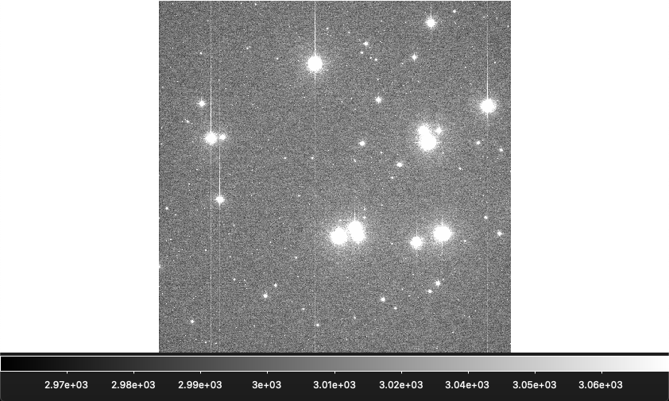
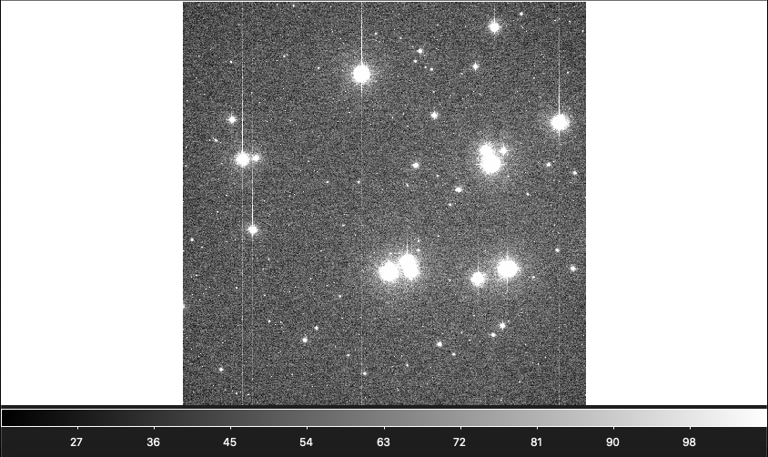

# Blog Post Week 2

## This Week's Work

### Bias Correction: What is it and why is it necessary?

### What does the code look like for the bias correction?

~~~ python
def bias_subtract(filename, path_to_bias):
    '''
    This function takes filename file (the bias frames) and subtract the custom bias.
    '''
    # Load in data for a given file
    dat_load = fits.getdata(filename)
    # Read header for that file
    dat_header = fits.getheader(filename)
    # Load in data for master bias frame
    master_bias = fits.getdata(path_to_bias)
    # Make custom bias: get median overscan and scale
    med_overscan = np.median(dat_load[os_1:, os_2:].flatten())
    med_bias     = np.median(master_bias.flatten())
    custom_bias  = master_bias[:os_1, :os_2]*med_overscan/med_bias
    # Subtract master bias from an input FITS 'filename'
    sub_frame = dat_load[:os_1, :os_2] - custom_bias
    #finish this code too to save the FITS. Make sure it has the correct header!
    fits.writeto('b_' + filename, sub_frame, dat_header, overwrite = True)
    return
~~~
This is the function in my module used to perform the bias subtraction on each frame. For the most part this is identical to the analogous function used in A337, with the difference under "Make custom bias" as here we compute the median overscan, median master bias value, and rescale the master bias by multiplying out the median overscan over the median master bias. This is essentially the same as outlined in my pseudo code for the class exercise.

### After applying the correction to an image, how does it appear?

Below is a raw science frame, image 137 from 2020/01/19, a visual band praesepe frame. The scale is zscale and represents the entire frame:

And we see the same image, also zscaled, after we perform bias subtraction:

As we would expect, the values seem to be approximately uniformly reduced. However, note the median sort of values of the background, i.e. the lowest bins given in the scaling: they land around ~50 ADU after bias correction, compared to ~3000 before. In contrast to this, a typical source we're interested in might have ~600 counts after versus ~3600 counts before; a marked improvement in signal to noise, despite a very rough measurement.

## Annotated Bibliography (Herbst, 2007)

## Proposal Outline: feedback and goals

## Papers found relevant to project

