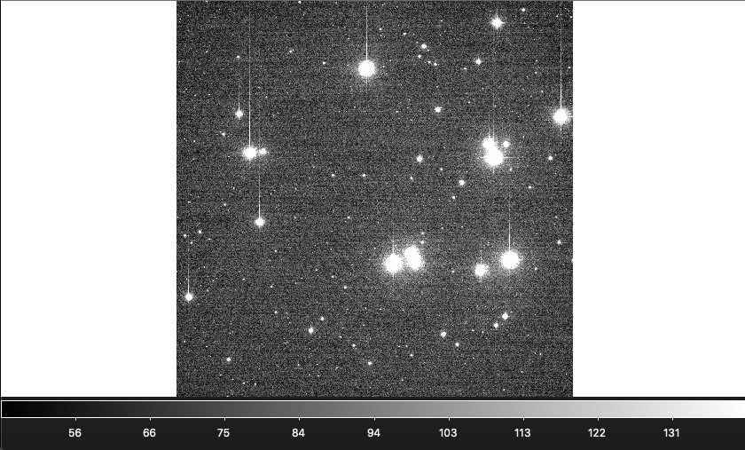
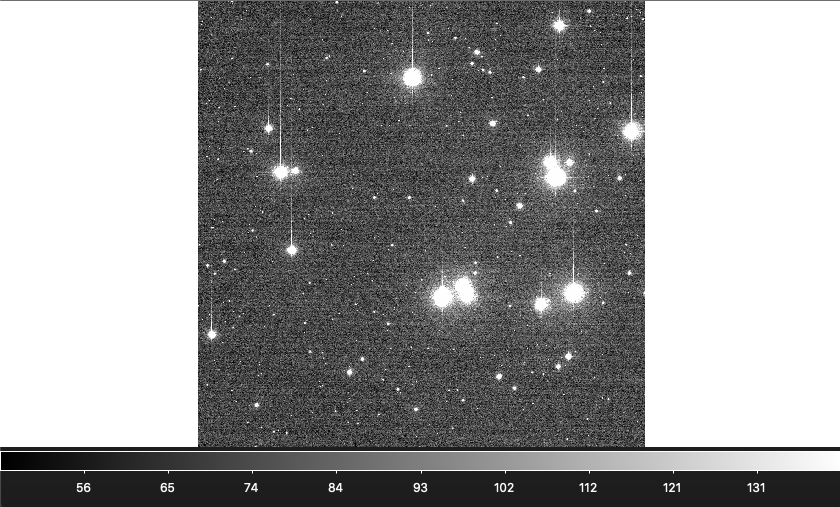

# Blog Post Week 3

## This Week's Work

### Progress on bias and flatfield correction

Bias correction for the entire dataset was already completed last week; for those results see Blog Post Week 2. Flatfielding, on the other hand, is not quite complete yet, however I am in a very good position. My module code to prepare each master flat is finished, as well as the code to perform the flatfield correction on science frames. Below is the python code in my module for each of these functions:

~~~ python
#
# norm combine flats: normalize each flat frame then median combine the set
#
def norm_combine_flats(filelist):
    '''
    Divide each individual pixel by the median pixel value to normalize the flats.
    All flats same exposure time!
    '''
    # Assign a variable to the length of the input filelist
    n = len(filelist)
    # Assign a variable to the data associated with the first file in the file list (index of 0)
    first_frame_data = fits.getdata(filelist[0])
    # finding the x and y dimensions of teh first_frame_data array
    imsize_y, imsize_x = first_frame_data.shape
    # creaing a zero array with dimensions y*x*n
    fits_stack = np.zeros((imsize_y, imsize_x , n))
    # Go through every file in the input filelist, get the data, then normalize each pixel in the flat
    for ii in range(0, n):
        im = fits.getdata(filelist[ii])
        norm_im = im/np.median(im.flatten()) # finish new line here to normalize flats
        fits_stack[:,:,ii] = norm_im
    # median combine the normalized flats
    med_frame = np.median(fits_stack, axis=2)
    return med_frame
#
# flatfield: perform flatfielding on a science frame
#
def flatfield(filename, path_to_masterflat, band):
    '''
    Takes a fits file path, a corresponding master flat file path, and a
    filter name and performs flatfielding on the fits file.
    '''
    # Load in data for a given file
    dat_load = fits.getdata(filename)
    # Read header for that file
    dat_header = fits.getheader(filename)
    # Load in data for master flat frame
    master_flat = fits.getdata(path_to_masterflat)
    # Divide master bias from an input FITS 'filename'
    sub_frame = dat_load / master_flat
    # Write results to file
    fits.writeto(str(band)+'_flat' + filename, sub_frame, dat_header, overwrite = True)
    return
~~~
For the most part, this is the same as the corresponding functions used in AST 337; since they were very adaptable, very little was changed. One correction was made where the norm_combine_flats function used the maximum value rather than the median to normalize each flatfield frame before median combining. To give some credit, my version of the AST 337 flatfield code was largely written by classmate Kenneth Lin as we shared code while completing that project.

After finalizing the code I went on to test it on some frames, then after being satisfied with those results, reduced each of the science frames for the first night of data. Here is an example, using the bias corrected vs. flatfielded versions of visual image 198 from night one:

These images are both full view and z-scaled. While there isn't much visually different, and also little difference in the counts, if you look closely you can see that the counts in the darker corners are brought up after flatfielding, and similarly the centre region is brought down slightly. Since this is more or less what we expect a flatfield to do, I am satisfied with this result. If there is a more rigorous way of testing this, that would be a good thing to look at before running the entire data set.

### Roadblocks encountered thus far

In terms of the technical work/data analysis I feel very up to date. As for the proposal and science side of things, I am actually quite worried. I feel as though I don't quite understand how to put everything together

## Revisit Science

### Summary of Boudrealt Paper 

The paper I am reading this week is "Brown dwarfs and very low mass stars in the Praesepe open cluster: a dynamically unevolved mass function?" by Boudrealt et al. Below is a summary of what the authors have to say:

The introduction begins with several examples of recent papers discussing the mass function of low mass stars and brown dwarfs in open clusters. The mass function of a stellar population is simply a histogram of (log-scaled) masses for the population, which is often modelled with a function. How this function changes from one cluster to another has substantial consequences on stellar evolution as this determines the mass evolution for a stellar population. The authors then justify the importance of studying the mass function (MF) at low mass limits, particularly in old clusters: for studying the luminosity and temperature evolution of brown dwarfs, how brown dwarf populations evolve, particularly what fraction are ejected from a given population compared to younger clusters, and also models are much less constrained for properties of very young brown dwarfs, despite most recent studies focus on younger objects. 

The authors then proceed to give a background on the Praesepe cluster and why it is a good candidate for this study, citing quantities for age, metallicities, distance, etc; additionally describing recent studies that focused on characterizing the MF on low end mass scales. The introduction ends by introducing the survey of the cluster conducted by the authors, and lining out the remaining paper structure.

Sections 2, 3, 4, 5, the body of the paper, are both dense and lengthy, and largely focus on techniques used to survey, reduce, and analyse the data collected in their Praesepe survey. Here are some highlights:

#### Data and Reduction
* Observations were taken in the near IR from a 3.5m telescope in Spain and in the optical on a 2.2m telescope in Chile
* The bands used include J, K, and in some regions I
* Authors describe bias, dark, and flatfield corrections, as well as photometric calibration
* Isochrones from Baraffe et al. are used for models of effective temperature and mass for detections
* Authors differentiate between a "dusty" model and "dust-free" model

#### Candidate Selection
* Use three candidate selection steps: the first is selecting only objects within a certain colour difference of a model isochrone on its CMD, for each combination of bands
* The second step does the same but for a CCD, of which there is only one given there are only three colours used
* Finally, the observed magnitude of the object is compared with its model isochrone magnitude based on its effective temperature
* These steps are meant to select only candidates from the cluster (as opposed to background/foreground contaminants) of interest

## Looking Ahead

### Next Data Analysis Steps

The first, most obvious next step is to perform the flatfielding on the other nights of data. Perhaps do some other checks to make sure I did it right for the first night, but otherwise there's no reason I can't go ahead and finish all if it using the code I have. It'll be fairly easy too- I simply have to CD into the directory for each night, create the master flatfield files in each filter, and do the flatfielding.

After that, I'll need to do shifting and stacking to account for drift in the frames from one exposure to another. I'm a little worried about this since I did some looking ahead during the observing run, using my AST 337 code to perform the shifting and stacking for one night's data on one object, and the result was not pretty: while flatfielding had removed dust doughnuts and the notorious hair in the centre of each image, my attempt at shifting and stacking actually brought these features back! My work on this was deleted as I did not have storage space at the time to hold onto the data so I cannot show evidence of this disaster. I hope the next few classes will introduce methods to improve on the shifting and stacking algorithm from last semester. 
