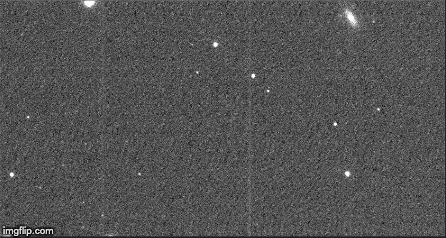

# Blog Post Week 4

## This Week's Work

### Bias Subtraction and Flatfielding Progress

Bias and flatfield corrections have been performed on all Praesepe VRI frames we'll be using from the larger data set. Using the algorithm described last class this was no challenge. The last step is to verify the correction was effective. To this end, I've been in touch with my project partner Johari to exchange data and methods files in order to compare results; if we both did the corrections identically the same, this would be a good indication the method we used was correct. Alternatively, if there is a difference then likely one of us made a mistake and we could discuss which one of us made the mistake and work to correct it. This has not yet been done, but I look to do it within the next week.

### Shifting and Aligning Images and shift_methods.py

Shifting has begun! Thus far I have done shifting to align a set of five I-band images from the first night of data to the first image in that set. The code for this process is as follows:

~~~ python
import numpy as np
from astropy.io import fits
import a341mod
import os
import shift_methods
import matplotlib.pyplot as plt
#
I_1  = ['I_flatb_c8867t0145o00.fits', 'I_flatb_c8867t0146o00.fits', 'I_flatb_c8867t0147o00.fits', 'I_flatb_c8867t0148o00.fits', 'I_flatb_c8867t0149o00.fits']
im_1 = fits.getdata(I_1[0])
plt.imshow(im_1[2420:2470, 2350:2390], vmin=50, vmax=800)  # centre at (2450, 2380) is a pretty good guess
xcen, ycen = 2450, 2380
xcenf, ycenf = shift_methods.centroid(im_1, ycen, xcen)
xcenf, ycenf = int(xcenf), int(ycenf)
for i in I_1:
    im_2 = fits.getdata(i)
    xshift, yshift = shift_methods.cross_image(im_1, im_2, xcen, ycen, 400)
    a              = shift_methods.shift_image(im_2, xshift, yshift)
    fits.writeto('shift_'+i, a, overwrite=True)
~~~

After importing necessary packages, I put the names of files I want to shift into a list of strings. While doing it manually like this is not ideal for when I'm working with all the data, this was just to test the algorithm and when I work out a better way to do this, the line defining I_1 will change. Next I take a look at the first image within that set, in order to get the position of a star with a good PSF. After some shifting around I came across a bright source near the centre of the image, and decided to use this for the input in the centroid and cross_image functions. Having this guess of the source's centre point I improve this by using the centroid algorithm from shift_methods, and turning its output into an integer. With this I have everything to do the shifting: begin a loop through the files, take out the next image data, call the cross_image function to find the shifts, then use these shifts in the shift_image function, and write the result to file. Doing all this after fixing bugs resulted in the following:

### Roadblocks Encountered and Their Solutions

One issue I encountered while attempting to shift images is that I had assumed the methods were meant to be used in the following way: make an initial guess for the central position of a star, do centroiding on this to correct this guess, then feed this position into the cross_image function to find the shifts. However, I was confused by earlier discussion on using integers versus floats in the shifting algorithm, and thought that meant cross_image could handle non-integer values. This turned out to not be true and it DOES require integer values, meaning I ran into many errors without understanding their source. Eventually I discovered my problem and fixed it by rounding the centroid's output to an integer before feeding it into the cross_image. I also had an issue where I was flipping my x and y coordinates, and did a quick fix by switching around variable names in the right places.

### Next Data Analysis Steps

## Back to Science

### Next Steps in Proposal Writing

### Differential Photometry

## Looking Ahead
