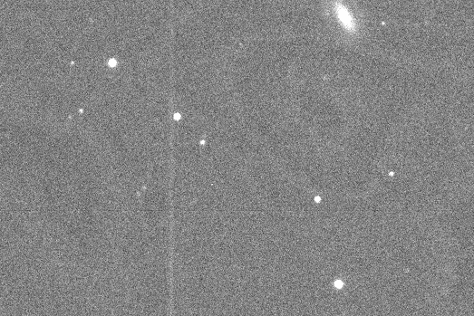

#Blog Post Week 6

## This Week's Work

### Reducing Remaining Nights' Data

My first draft of the full reduction process, with stacking, is now complete for all nights' data. I now have complete notebooks for sorting, bias correcting, flatfielding, aligning, and stacking the data for each night in the observing run. Updates since last week's status can be seen further down in the blog. Here I discuss some results from the final reduction. For each night, there were around 3-4 sequences of five images in V, R, I taken for Praesepe. Since I decided to stack based on sequence, this meant there are only 3-4 stacks from which to pull differential photometry per night. Given the data set however it seems this choice is optimal: deeper stacks will result in fewer light curve points while trying to pull out more stacks will result in lower signal to noise as well as the distance between light curve points would be less meaningful. 

There are some interesting (or concerning) features to some of the stacks. For example, many of the I stacks have "fringing" or alternating bright and dark bands that appear sometimes in near-infrared images. Below is an example of fringing in a stack from night 7:

### What is AstroImageJ and How Does it Work?

### Making a Light Curve with AstroImageJ

### Last Changes to Reduction Pipeline

### Comparison with Partner's Code
