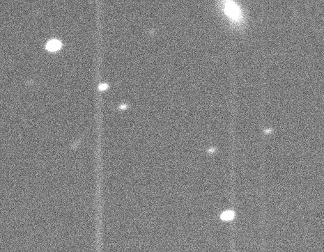

#Blog Post Week 6

## This Week's Work

### Reducing Remaining Nights' Data

My first draft of the full reduction process, with stacking, is now complete for all nights' data. I now have complete notebooks for sorting, bias correcting, flatfielding, aligning, and stacking the data for each night in the observing run. Updates since last week's status can be seen further down in the blog. Here I discuss some results from the final reduction. For each night, there were around 3-4 sequences of five images in V, R, I taken for Praesepe. Since I decided to stack based on sequence, this meant there are only 3-4 stacks from which to pull differential photometry per night. Given the data set however it seems this choice is optimal: deeper stacks will result in fewer light curve points while trying to pull out more stacks will result in lower signal to noise as well as the distance between light curve points would be less meaningful. 

There are some interesting (or concerning) features to some of the stacks. For example, many of the I stacks have "fringing" or alternating bright and dark bands that appear sometimes in near-infrared images due to some diffraction phenomenon. Below is an example of fringing in an I band stack from night 7:

The effect from fringing is clearly very faint, with a difference of ~20 ADU between peaks and troughs of the fringes, hardly noticible over the pixel to pixel variation already present in the image. In a project where higher SNR is required it might be worthwhile to take another step to remove the fringing, but for our purposes it shouldn't be necessary to do so. A more concerning phenomenon seen in the stacked images is a smearing of the stacks for the second night:

These are a V band stack and an R band stack respectively from night 2 from different image series. Since this is present across bands and sequences, there's no single bad image that can be removed to fix the smearing. The aligning for these stacks also seems to be fine, light from the same sources seems to land on the same pixels. I may have to look for a fix for this if this causes trouble during the photometry step. For the moment, I will continue to look for a fix for this issue and check with other students to see if they also see the same issue. Besides these two issues, everything else with the reduction seems to have worked fine.

### What is AstroImageJ and How Does it Work?

AstroImageJ is an astronomy software tool for image analysis, specializing in image sequences. In other words, it's used for time domain photometry, or production of light curves. Features include viewing fits images and switching between images in a sequence, reading and writing fits images and headers, image reduction tools, and most importantly time series multi-aperture photometry, or aperture photometry for several sources simultaneously for each image in a sequence of images. As part of this function it can do ensemble photometry with on-the-fly changes to the choice of stable sources, light curve plotting and fitting, and several other sub-methods. It performs photometry on a target T in the following way: compute the flux from T by adding the pixels within a defined aperture, and subtract off an average annulus flux, then to get the relative flux from T in a given frame, divide its flux by the sum of individual fluxes from the ensemble stars C1 through Cn. Error on this measurement is computed via a variation on the CCD equation for noise in an aperture, and propogating the errors for target and ensemble fluxes. From here, exposure timestamps are taken from the header and then relative flux can be plotted against the observation date to obtain a light curve.

### Making a Light Curve with AstroImageJ

Here I go over my process of creating a light curve from HDI data using AIJ. I begin by opening AIJ and importing the HDI data. First I had to set up aperture settings corresponding to HDI. Since HDI has a FWHM size of 12 pixels, I decided 2.5 times the FWHM is appropriate aperture size, so this was set to 30 pixels. Annulus size was then set to 40 and 50 pixels for the inner and outer radii, which seems okay based on last semester's analysis. Several HDI parameters had to be input such as gain (1.3 electrons per ADU), dark current (0.23 electrons per pixel per second), and readnoise (8 electrons). After doing this I was able to begin multi-aperture photometry: I first marked the target star with its relevant aperture, then proceeded to mark ensemble stars. My strategy for selecting these was not to locate any particular type of star or behavior but simply to do as many as possible to reduce the effects of variable stars being selected, in all I had 36 ensemble sources to my one target. Once I did this, I could run the photometry on the 7 frames given, which resulted in the following light curve:

I then repeated the whole process using a different set of ensemble sources to get a very similar result. I'm slightly doubtful of this result considering the variations in brightness seem to be rather large (~5%) and yet they don't seem to follow any sort of period or trend, however given we only have seven points this may not be useful to point out, and reproducing my result with different settings is quite reassuring. 

### Last Changes to Reduction Pipeline

Since last week's update I have fixed the issue with aligning certain bands' images. The problem was not with a NaN value messing with the interpolation, instead it was an Inf or "infinity" value having the same effect. After setting this value to the array median and proceeding with alignment everything worked great for each band. Below is the final code I used on each night's data:
~~~ python
rframes = glob.glob('*flatb*.fits')  # get reduced science frames
for j in rframes:
    im, h          = fits.getdata(j, header=True)
    w              = np.where(np.isinf(im)==True)[0]
    im[w]          = np.nanmedian(im)
    im2  = np.nan_to_num(im)
    xshift, yshift = shift_methods.cross_image(pstack, im2, xcenf, ycenf, 400)
    print(xshift, yshift)
    shifted        = shift_methods.shift_image(im2, xshift, yshift)
    print('Writing shift_'+j)
    fits.writeto('shift_'+j, shifted, h, overwrite=True)
~~~

This produced shifts similar to those shown in a previous blog post for all of the observing run's data; light from the same source fell on the same pixels to within ~1 pixel. The other change made to my reduction process is finally the addition of code for stacking aligned images. This code has two parts as seen below:

~~~ python
# Sort images into lists by band and sequence number
Vstack   = glob.glob('shift_V_flatb*')
Vstack_1 = Vstack[:5]
Vstack_3 = Vstack[5:10]
Vstack_2 = Vstack[10:]
Istack   = glob.glob('shift_I_flatb*')
Istack_1 = Istack[:5]
Istack_2 = Istack[5:10]
Istack_3 = Istack[10:]
Rstack   = glob.glob('shift_R_flatb*')
Rstack_1 = Rstack[:5]
Rstack_2 = Rstack[5:10]
Rstack_3 = Rstack[10:]
~~~

I begin the stacking process by grouping each bands' files into three or four lists, one for each sequence of ~5 images taken throughout the night. This is done for reasons as described above. I decided not to code new functions for this process as the images corresponding to each sequence are variable from sequence to sequence and night to night, and since grouped this way verifying each list was correct was very straightforward it simply made more sense to hard code the files used. Next is the more interesting part:

~~~ python
# use stacking algorithm on above lists
stack_subarray.stack_subarray(Vstack_1, 'Vstack_1.fits')
stack_subarray.stack_subarray(Vstack_2, 'Vstack_2.fits')
stack_subarray.stack_subarray(Vstack_3, 'Vstack_3.fits')
stack_subarray.stack_subarray(Istack_1, 'Istack_1.fits')
stack_subarray.stack_subarray(Istack_2, 'Istack_2.fits')
stack_subarray.stack_subarray(Istack_3, 'Istack_3.fits')
stack_subarray.stack_subarray(Rstack_1, 'Rstack_1.fits')
stack_subarray.stack_subarray(Rstack_2, 'Rstack_2.fits')
stack_subarray.stack_subarray(Rstack_3, 'Rstack_3.fits')
~~~

Here I've converted Mike Peterson's stacking code from a file to be run on a set of data in the directory (with hard-coded paths!) to a function that can be used more generally, given inputs for the input list of files which can even be in other directories, as well as a method to name the output stacked file. Other than these, the algorithm was left untouched. This produced 3-4 stacks per band per night such as those in the figures seen above. As far as I know this could potentially be the last update to the reduction portion of my code, although there are still problems that may need fixing such as those listed in one of the above sections. 

### Comparison with Partner's Code

In order to see where we have issues, my group partner and I have begun exchanging information on how we've done the data reduction in order to see where overlooked problems may have occured. The first analysis we can do on this is simply compare two of the same images after shifting but before stacking and look at the overall appearance of the images as well as seeing the difference between corresponding pixels. Since we shifted images in a slightly different way, we cannot directly compare the files by subtracting one array from the other as this result would be meaningless, and shifting the two to match would also introduce other effects. Looking at the same region on each and scaling coorrespondingly, we indeed see no visual difference between the fits file I produced and the one Johari produced, looking overall at the region in question. When comparing the values of individual pixels (taking into account their different positions on the image) we see based on a small (~10 pixels) sample an average value difference of ~5 ADU. This is in comparison to the random pixel-to-pixel variation throughout each image of ~20-30 ADU, a much higher value. Based on this result we are quite satisfied that either both reduction processes are correct or (hopefully not) both incorrect in the same ways. Looking at the code used to produce this image, we also see lots of similarities. Stylistic choices such as comments and variable names differ throughout the two pipelines, but the algorithms seem to be more or less the same. This also assists towards arguing that our process is either correct or incorrect in the same way.
