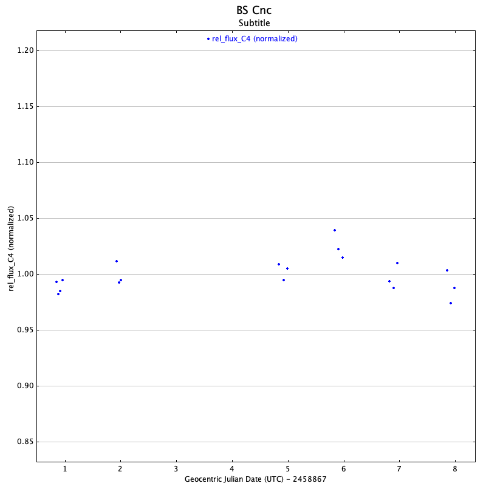
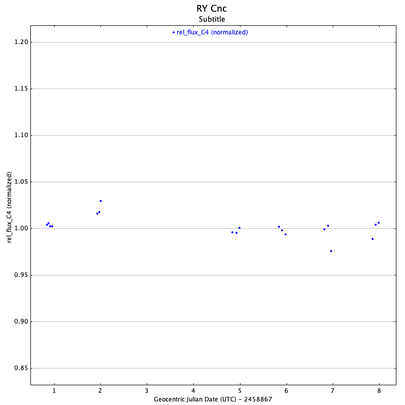
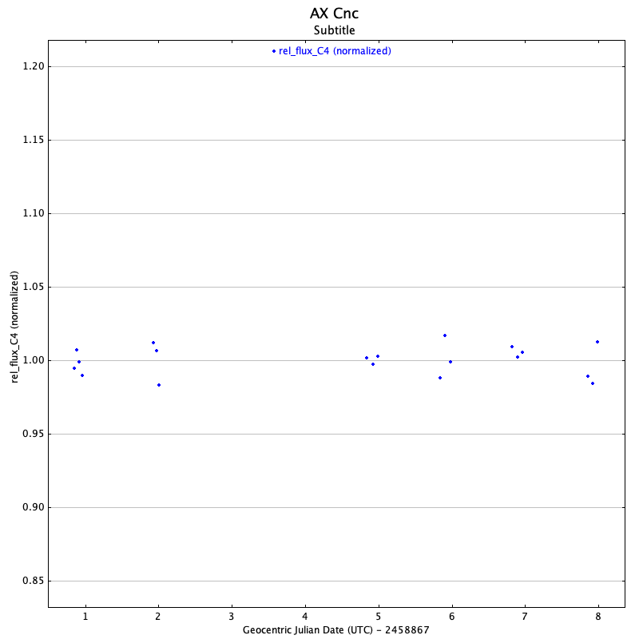

#Blog Post Week 7

## This Week's Work

With my draft stacks in each band and after finally getting AIJ working on my main computer I was able to compute some light curves for sources in the Praesepe field. Below are the light curves I got by looking at three of the sources from the AAVSO spreadsheet:

I'm still not quite sure on how to best select comparison sources; all of the light curves seem to have very little variation through the observations, and the most likely scenarios seem to be either I'm incorrectly finding the relevant star on my fits image, the variations are simply too long (or perhaps even too short) to detect, or my selection of comparison stars prevents the variation from showing up in the final light curve. While the first two are definitely possible and should be looked into, I fear it is the third that is causing this, so I need to figure out how to best make these selections before proceeding with more light curve generation.

## Reading Notes

### Fourier Transform

(Since I've previously watched *But what is the Fourier Transform? A visual introduction.* I'd rather give a different introduction to Fourier Transforms.)

A Fourier Transform is a functional that converts the input function from signal space to frequency space. In simpler terms, this is a functional, i.e. a function that takes a function as an input and also returns a function, that samples the function for repeating signals, and converts this function into one that peaks where frequencies of repeating signals are likely to be present. The mathematical form of this functional is the following: $$F(k)=\int_{\mathbb{R}}f(x)\exp(-2\pi ikx)dx$$ where f(x) is the original function. This turns out to be one of the most useful tools in science and mathematics, with applications in just about any field from pure mathematics to biology, computer science, and of course astronomy.

In order to understand a little better, consider the Fourier Transform of the cosine function: $f(x)=\cos(2\pi k_0x)$, which has a frequency of $k_0$ (first repeats when $x=\frac{1}{k_0}$). The transform of this worked out with the above expression is $F(k)=\frac{1}{2}(\delta(k-k_0)+\delta(k+k_0))$. Note this function is nonzero only twice: at $x=\pm k_0$, which is of course the only frequency of this cosine function; there is no spread as this is exactly the frequency. Additionally, the integral over this function is equal to one. Based on these properties one might conclude the Fourier Transform of a function is a probability distribution; while this is not exactly true, it is analogous, and in some applications one can interpret the Fourier Transform as the probability distribution of frequencies present in the function.

When doing science that relies on data and smooth, continuous functions are not available, we can use the Fast Fourier Transform (FFT) algorithm to approximate the functionality of the Fourier Transform on the real line. The drawback is that instead of resulting in infinite peaks exclusively at frequencies present in the function, we end up with finite peaks spread out over a range of values. But if the transform is nonzero at an infinite number of locations, how can one tell where the frequencies are? This is where the probability density interpretation comes in handy: by integrating over certain regions, one can estimate where exactly the peaks are, and how strong they are relative to each other and in this way determine the signal and noise of estimated frequencies. 

One more piece to the FT puzzle is needed before we can talk about the relevant application: traditional FFT algorithms require evenly spaced sampling points. In astronomy however, we are typically not so blessed outside of the laboratory. Instead a modified algorithm is used, known as the Lomb-Scargle Periodogram. While one could easily go into detail on how the LS Periodogram is produced, it is sufficient here to say that it is an optimal tool for the application of finding the period of brightness variation from light curve points: since we take many observations of a source per night, and the observations are not evenly spaced, the LS Periodogram can interpolate between missing points and in this way produce the frequency spectrum of a light curve's brightness variations. For this reason we will be using the LS Periodogram in class to estimate periods for our detected sources.

### Time Series Analysis of Variable Star Data

Interpretation of time-domain data has a long history in science, maths, and astronomy. The culmination of research in this area was the discovery of the Fourier Transform and FFT in the 19th and 20th centuries. For some time dependent data $x(t)$ (written f(x) in my above analysis) one can compute the Fourier Transform by calculating an integral over the real line. With the complex exponential present in the functional this actually acts as splitting sine and cosine components into imaginary and real parts of the integral. One can also compute a data fourier transform (FFT) by approximating the integral by summing over sampled data. In this case the quality of the transform is dependent on the sampling rate. The Nyquist frequency is the smallest detectable frequency based on the number of samples and total time period over which the samples were taken; to "detect" a frequency one must have a maximum and a minimum although certain techniques (e.g. aliasing mentioned in the text) can allow even smaller frequencies to be detected.

As is to be expected, errors in the data will propogate into errors in the fourier transform. The effect this has on the transform takes the form of small, noisy peaks scattered at all frequencies. Determining errors in frequency estimates from the fourier transform is a complicated task, and numerous algorithms and packages are available to perform this task.

Of the many Fourier Transform algorithms, the ones we are mainly interested in are the FFT and LS Periodogram mentioned above. FFT has the benefit of being computationally inexpensive while requiring evenly spaced data points; LS is not restricted in this way however it is a much slower algorithm. Indeed, we have actually used FFT before in class for our alignment algorithm, however this will not be an option with our unevenly spaced photometric data. On the other hand, by doing FTs using the LS Periodogram, we can detect brightness variation periods present in our data. If there are multiple periods present, we can also detect more than one at once by finding the multiple peaks in the Fourier Transform.

While it is the most widely used, the FT is not the only method available to do time series analysis on variable star sources. An example of a statistical method is called autocorrelation: this method compares data separated by time interval tau, and determines what tau best estimates the characteristic time interval, or in our case the period, of the data. While this may give less information than the FT it is better suited to stars whose variability is not shaped like a sinusoid, e.g. semiregular variables that do not follow single, long term periods. Another method is ANOVA, which is typically used in engineering or finance but also can be applied to variable stars: this method creates a folded light curve for some test period and measures the resulting variance: the period that produces the smallest variance is then the characteristic period. Other statistical methods are available to solve different problems, such as those suited to data sets with large gaps.

### Paper Discussion

Some recent, relevant papers I looked at:

#### Stellar population astrophysics (SPA) with the TNG. Revisiting the metallicity of Praesepe (M 44) 

While this paper does not look at rotation rates, variability, or any of these topics we're interested in, it does talk about the age of the cluster and comparing this to that of the Hyades cluster, which is why this paper is interesting. In this work they conclude that Praesepe is slightly younger than previously postulated, closer to ~600 Myr rather than ~750 Myr, and additionally younger than Hyades, thus the two clusters cannot have a common origin. They also discuss gyrochronology briefly in this paper, and while I did not get a chance to really dive in and understand, this might be an interesting place to look for techniques I can use in my project.

#### Spectral library of age-benchmark low-mass stars and browndwarfs

This paper also does not directly relate to the project in any of the main catagories however it does do many interesting analyses that touch on the peripheries of relevance to the project. Here the authors are mainly focused on comparing surface gravity estimates to those computed with spectrography. Of relevance is how they match their catalogues with many external data sets, use data from many clusters including Praesepe, do analysis on how certain properties vary with age, and how they go about flagging previously undiscovered binary candidates. Their work is additionally focused mainly on M and Brown Dwarfs, so for these reasons was interesting to look through and might be valuable to follow up on.

#### Radial velocity confirmation of K2-100b: a young, highly irradiated,and low density transiting hot Neptune

Planets detected in open clusters are relatively rare, so it was interesting to see a paper on the confirmation on one. Sadly, it sits slightly outside of our field of view so no direct analysis can be done on its parent star. The parent star has similar qualities to the sun, being slightly larger and more massive but much younger at ~750 Myr according to the determination by the authors. They used radial velocity method to confirm the planet, and were able to do some unique analysis on the simultaneous effects on radial velocity by the orbiting planet and the stellar activity. This work might be more relevant if my project used the H-alpha data however since we are only using the optical data it seems little can be drawn as the host is out of range.
