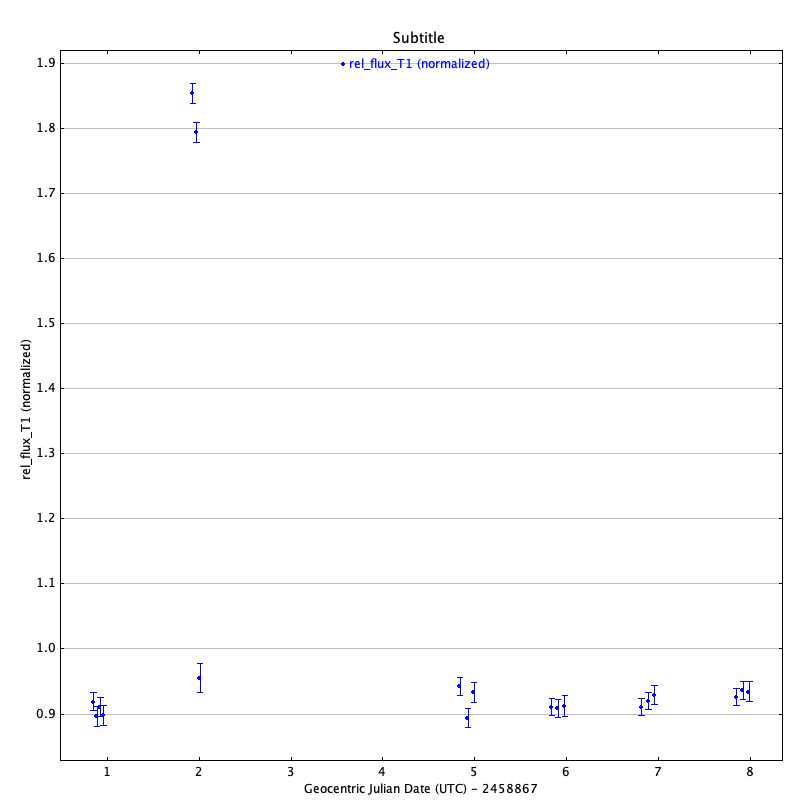
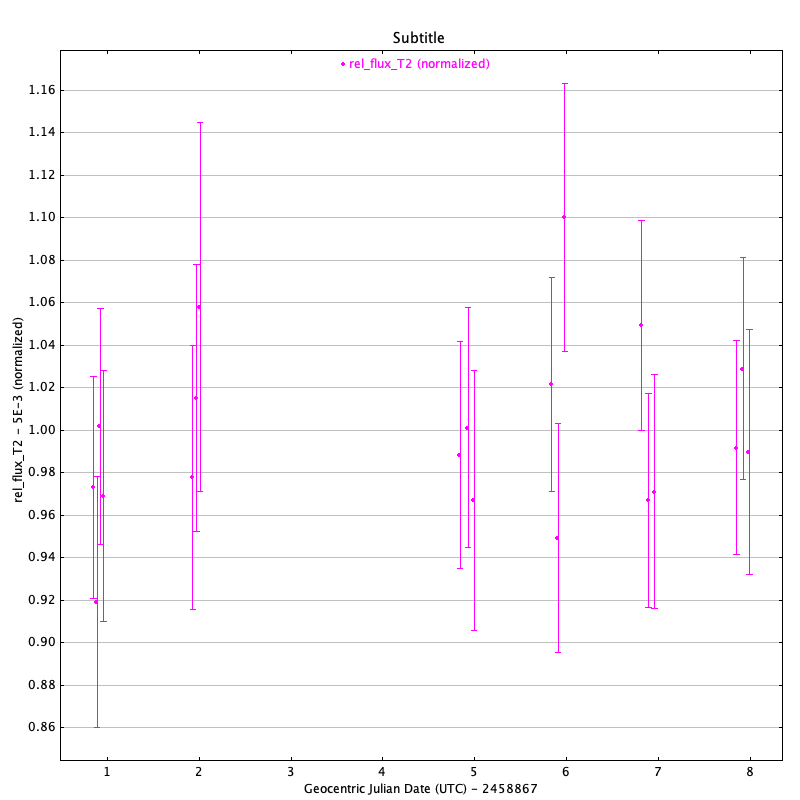
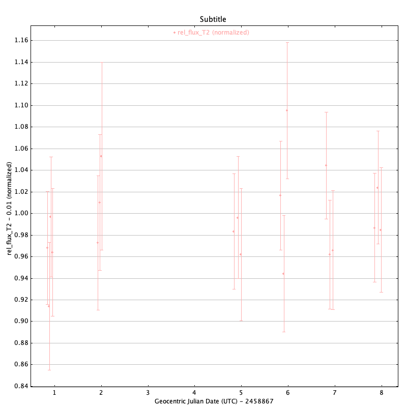
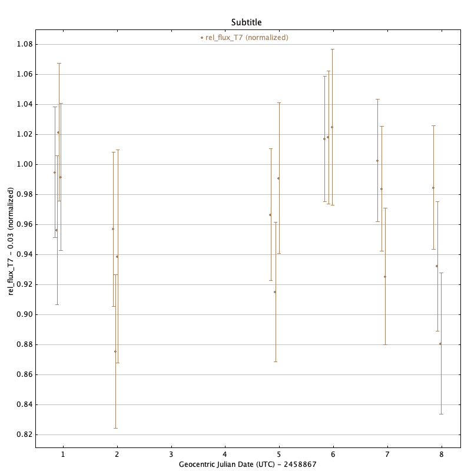
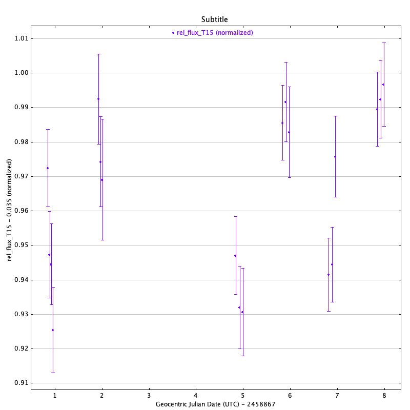
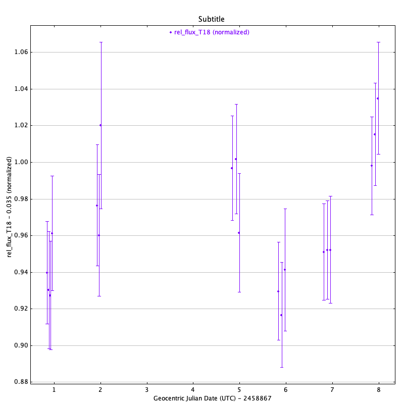

#Blog Post Week 8

## This Week's Work

### Light Curves of Matched Sources

I have produced light curves in R and V bands for matched sources detected in our field that have spectral type M3 and above. This is 18 sources in total; two were removed as they were in close proximity (~2 FWHM) to other sources and thus would have interfered with the computation of the total flux. Below are some examples of light curves computed from the R band data:

(R band light curves for T1, T2, T3, T7, T15, T18. Sources will be rematched to IDs at a later time) For the most part they seem believable, with the exception of the two outlying points on T1 on night 2. Night 2's data is particularly poor so this is one explanation, however further analysis is required.

### Matching Data to External Catalogues

One of the goals looking towards the final presentation is to match our source list with tables from other publications that have certain data we were unable to collect during our observing run but may be useful in our further analysis. To this end, I've used detected sources in our Praesepe field to match with certain catalogues from Vizier. The first one I matched with was the enormous 2MASS catalogue containing J, H, and K photometry; then I also matched with a more recent publication, "Activity and Rotation in Praesepe and Hyades" which has estimated mass, radius, luminosity and other stellar properties. It seemed that after matching both, no additional sources were lost (after the additional matching with Kraus 2007). Here's a preview of the matched table:

~~~
arcmin;deg;deg; ;"h:m:s";"d:m:s";%; ;mag;mag;pc;Msun;Msun;Rsun; ; ;0.1nm;10-5
------;-----------;-----------;----------------------;-----------;------------;-----;-----;-------;-------;----;--------;------;----------;-;---;---------;---------
0.0147;129.9715000;+19.4010389;AD 2642               ;08 39 53.16;+19 24 03.74;   82;M3   ; 16.596; 13.014;    ;        ;  0.26;          ;N;   ;   -3.187;   15.725

0.0199;129.7628333;+19.4043444;HSHJ246               ;08 39 03.08;+19 24 15.64;   99;M4   ; 18.116; 13.407;    ;        ;  0.21;          ;N;   ;   -6.323;   16.708

0.0130;130.0173333;+19.4139639;JS718                 ;08 40 04.16;+19 24 50.27;   99;M3   ; 17.155; 12.967;    ;    0.33;  0.26;    0.0377;N;   ;   -8.671;   31.011

0.0135;129.9767083;+19.4603361;HSHJ291               ;08 39 54.41;+19 27 37.21;   99;M4   ; 18.005; 13.358;    ;        ;  0.22;    0.0157;N;   ;   -4.278;   11.732

0.0112;129.9235833;+19.4834778;HSHJ283               ;08 39 41.66;+19 29 00.52;   98;M5   ; 19.802; 14.174;    ;        ;  0.16;          ;N;   ;   -5.087;    7.436
1.2238;129.9018750;+19.4855222;JS301                 ;08 39 36.45;+19 29 07.88;   99;K8   ; 14.367; 11.391;    ;        ;  0.60;          ;N;   ;    0.168;

0.0087;130.1735833;+19.5002139;HSHJ328               ;08 40 41.66;+19 30 00.77;   99;M5   ; 18.742; 13.536;    ;        ;  0.20;          ;N;   ;   -6.956;   13.472

0.0094;129.8030000;+19.5046833;2MASSJ08391273+1930169;08 39 12.72;+19 30 16.86;   84;M6   ; 20.315; 14.342;    ;        ;  0.16;          ;N;   ;   -9.271;   10.644
~~~
...and so on, continuing for about ~70 lines.

## Reading

### Summary of "Evidence from stellar rotation for early disc dispersal owing to close companions"

In order to gain better understanding of the scientific basis for my project, I was assigned this paper by S. Messina. Based on the title and abstract they seem to discuss the observational effects on premature disruption of the disk by means of a binary companion or otherwise,

For otherwise similar G, K, M spectral type stars, the rotation rate dependence on mass varies at young ages, however at ~0.6 Gyr the distribution narrows into a roughly one to one correspondence. Phenomena that affect the rotation period for younger sources include disk locking and disk lifetime: for the latter, early disk dispersal can result in a higher rotation rate. Furthermore, a common source of early disk dispersal is the presence of a binary companion, thus the author's intent is to use a novel data set from the ~8 Myr Upper Sco. region to study how relationships between rotation period and binary parameters.

As a first the author discusses previous analysis done to select binary stars in Upper Sco. specifically Tokovinin & Briceño's 2018 paper, which found 70 relevant binaries by selecting sources with multiple periods. The subset used in this paper is then narrowed down to 49 sources as only M spectral types are relevant here. 

The next section is the longest of the paper, and is where the author goes into detail on how relation between mass and rotation rate for binaries is computed. This is best explained through Fig. 2 in the paper,

As described in the caption, individual and binary sources are plotted by period versus V-K colour, with primary and secondary binary sources singled out, and the whole relation fit with a linear regression. Colour index can often be used as a proxy for mass, which seems to be done here. The author then seeks to see how sources that are part of a binary component behave (with respect to how well they are period predicted by the fit relation) differently compared to individual sources and how different mass ratios correspond to different periods. A large portion of the analysis section is spent detailing how colour indices of each binary component are estimated, which is of course necessary for comparison but is omitted here for brevity. Next the main analysis is this: separate the data into bins for binaries with similar mass components (M1/M2>0.9) and more different mass components (0.8<M1/M2<0.9), then for each source compute the fit residual, i.e. the difference between the period computed through light curve periodograms and the period computed by matching the colour to the fit line. In the end, the author finds similar mass binaries have periods shorter than individual stars by ~0.4 days on average while those in different mass binaries have periods shorter by ~1-2 days. After this is computed the author additionally finds average differences of periods between the two sources in each binary, finding a difference of ~0.8 day for similar mass binaries and ~0.2 day for different mass binaries. Finally, the author compares disk fractions for individual and binary sources, and finds 28% for the former and 14% for the latter. 

Some questions I might have for the authors include the following:

* Based on other publications I've had the impression the disk-locking mechanism has some controversy surrounding it, yet the author here seems to take it as a given, is this the intention or does this issue have more consensus that I've been led to believe?
* How confident can we be that a periodogram with multiple peaks indicates a binary system rather than simply a more complex variability or even a factor of error (i.e. aliasing, inherent repeated signals, etc.)?
* While general trends agree with previous studies, both observational and theoretical, do the numerical results agree with those found previously for other regions, or with theoretical predictions?

Considering how the paper largely concerns disk objects (specifically ~8 Myr) this paper sadly will not have much relevance to my project (concerning Praesepe, at ~650 Myr) other than the comment in the introduction about how the period-mass relation for late type stars stabilizes at this age. However if there are any binary sources in the field then there could be portions worth looking at, e.g. finding a similar mass-colour relation for older stars and seeing how well it predicts the binary's periods. 

