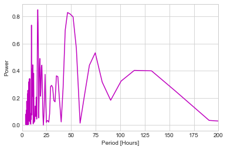
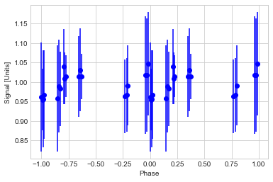

#Blog Post Week 9

## This Week's Work

### Updated Lightcurves: Python Photometry

This week I used the code in the class exercise on light curve generation as a base for plotting light curves over all targets, bands, using the stacked images prepared earlier (as described in previous blog posts). Here is an example of the code I used to do differential photometry on the R band images:

~~~ python
im                        = glob.glob('RSequence/*.fits')  # get red images
times, Photometry_initial = doPhotometry(im, xpos, ypos, aprad, skybuff, skywidth, timekey='MJD-OBS')  # aperture phot.
ePhotometry               = doPhotometryError(im,xpos, ypos, aprad, skybuff, skywidth, Photometry_initial, manual=True, xboxcorner=2000, yboxcorner=2000, boxsize=200)  # and error
Photometry, cPhotometry   = detrend(Photometry_initial, ePhotometry, nstars)  # detrend
most_accurate             = findComparisonStars(Photometry, cPhotometry, comp_num=12)  # find our comparisons
dPhotometry, edPhotometry, tePhotometry  = runDifferentialPhotometry(Photometry, ePhotometry, nstars, most_accurate)  # diff photometry
diffPhot_IndividualStars(datadir, memberlist, ra, dec, xpos, ypos, dPhotometry, edPhotometry, tePhotometry,times, 'Praesepe_1_R', wcs_image, most_accurate)  # photometry for targets
~~~

Note this is missing certain steps necessary for differential photometry: most notably source detections. This step was only done on the V band images for consistency; the source list and aperture placements were stored from the iteration for V band sources and reused in the R and I band images. Few significant choices of my own are made in this code, however there is one important one: the number of comparison stars, comp_num, located in line 6. I'll come back to this in my discussion on variation seen in these sources. In order to generate and save light curve plots from these data I use the following code, which saves a PDF containing the light curves:
~~~ python
with PdfPages('Praesepe_1_R.pdf') as pdf:
    for i in range(16):
        fig = plt.figure(num=1, figsize=(16, 16))
        fig.suptitle('Praesepe Targets R Band')
        fig.text(0.5, 0.04, 'Time (Days Since Beginning Observation)', ha='center')
        fig.text(0.04, 0.5, 'Rel. Flux', va='center', rotation='vertical')
        for j in range(4):
            plt.subplot(2, 2, j+1)
            plt.errorbar(dataR['time'], dataR['flux'][:, 4*i+j], yerr=dataR['flux'][:, 4*i+j], fmt='go')
        pdf.savefig()
        plt.close()
~~~
These piece of code was used to make a PDF for each band's light curves, and additionally a PDF for light curves containing all three bands simultaneously.

<embed src="https://noah-goldman.github.io/Praesepe_1_V.pdf" type="application/pdf" />

These are the light curves from the V photometry. I will be using this file to reference individual light curves in my below analysis.

### Interpretation of Light Curves

#### What kinds of variation are present?

What we're looking for in these light curves is variability that would indicate the presence of starspots rotating into and out of our line of sight towards the target in question. Unfortunately, many phenomena seem to be obstructing the discovery of any such sources, as I explain here. The first challenge is to look for signal through the error bars; this is a problem both visually, as the error bars are much larger than any variations in the photometry making variations difficult to see, as well as statistically, since it's hard to justify that any flux variations on such a scale compared to the errors is meaningful. A ballpark estimate of variation versus error for the typical source seems to be the ratio 10:1 error to maximum variation throughout the observing run.

Another issue is that certain trends seem to be present in some of the light curves. Notice how some sources seem to peak near the end of the second night or follow eerily similar yet still distinct variations throughout the observations. Rather then inherent variations this would seem to be the result of flaws in the reduced data. The stacked images from the second night, for example, are particularly blurry and thus we would expect flux measurements from this night to be of particularly poor quality: this would seem to agree with the apparent brightening on night two for many of the light curves. For trends present on other nights this could potentially be a problem of simply too few comparison stars; I initially used six comparisons for the light curves, which resulted in even greater trending variation present in multiple sources than my final choice of 12, however could potentially be too few as well, or one or more selections for which stars are good comparisons could actually be quite a poor choice. More analysis is needed in these respects.

Despite all these, there are a handful of sources that may really have variability not due to some sort of error. The third source on page 10 and the very last source in the PDF for example seem to defy the trended variability and high errors to produce some sort of multi-night variation. Whether the variation is due to rotation is another question entirely, although it looks possible.

#### How can we interpret variations in different bands?

Considering all the pains in looking at variation in a single band, one can imagine looking at multiple simultaneously has even more difficulties. There seem to be some general trends present in the sources that do seem to have variability:

* Increases in one band seem to correlate with increases in another.
* Each band within each night seems to follow other points from that night in that band reasonably well.
* Thus a typical scenario might be increasing in all bands over a night while the points trifurcate into their respective bands.
* Data from nights that had the "trending" discussed in the section above (nights two and eight mostly) have similar trending over all bands.
* One source seems to have very large (>0.5 change in relative flux) variations in R band while nearly no variation in other bands.

These are all worth looking into more, but since the issues going on in the previous section are even more present here, they should be revisited once the issues are addressed.

### Periodogram Analysis

Now having light curves I can begin on the crucial part of the analysis: computation of rotation periods. As described previously, I'll be doing this using the Lomb-Scargle Periodogram on the light curve data. In class we did an exercise calculating such a periodogram for some sample data; below is the code from that activity adapted to a single V band light curve from my sample:
~~~ python
f, p = LombScargle(dataV['time'], dataV['flux'][:, 5], dataV['fluxerr'][:, 5]).autopower()
plt.plot(1/f*24, p, color='m')
plt.xlabel('Period [Hours]')
plt.ylabel('Power')
plt.xlim(0, 200)
~~~
This code has one major flaw: it cannot deal with nan values as whenever it encounters one (of which there are many) in the flux array, the entire power array is returned as zeros. Furthermore, the structure of the data file makes reassigning nans or avoiding them in the LS computation very difficult. In light of this, I only have to offer a single periodogram where there were no nans:

The periodogram itself doesn't seem to indicate a particularly strong periodic signal, particularly one that would indicate rotation. The periods we are looking for are on the order of the length of observations, or close to 200 hours. Instead, the peak is near 16 hours and the next at an even smaller period. The best possible rotation period seems to be the peak near 125 hours. I plotted its phase diagram:

There doesn't seem to be any indication of a (rotation induced) period here, so the likely explanations include that there is a flaw somewhere in my method, or that this source simply doesn't show rotations on the scale we're interested in. The next thing to do would be to compare this to the light curve, and also to do a periodogram for a source I am more convinced has rotation induced variability.

### Updated Table Matching

My focus has been on nailing down the code for doing the differential photometry, so I didn't much get around to doing matching with other data that may be of interest later in the project. I did however manage to match my detected sources with those from the catalogues of Boudreault, 2010 and Baker, 2010. In the end, each table only had a single match. While not of much interest in comparison to the ~70 matched sources from Kraus, they may become important if only a handful of those sources are found to have variability, so this will have been worth looking into.
